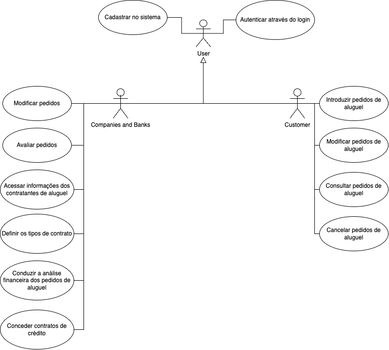
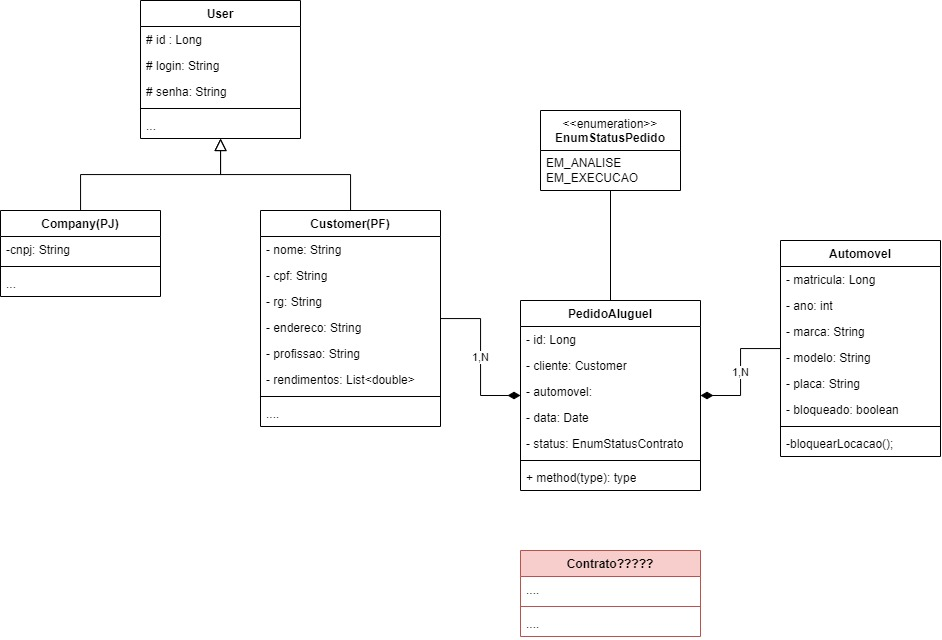
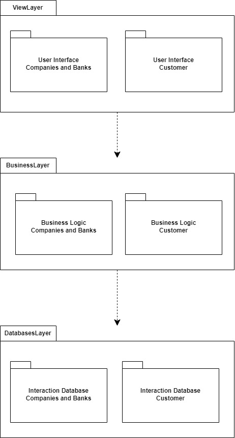
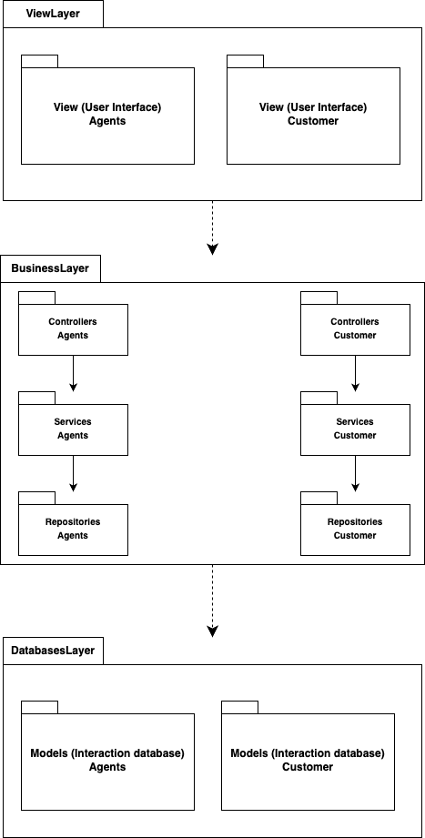

# Gestão de aluguéis de automóveis

## Alunos integrantes da equipe

* Eric Rodrigues Diniz
* Luiz Felipe Vieira
* Renato Paganini Thurler Filho

## Professores responsáveis

* Danilo Boechat Seufitelli

## Descrição do Sistema:
O sistema só pode ser utilizado após cadastro prévio.

Os usuários individuais (clientes) podem introduzir, modificar, consultar e cancelar pedidos de aluguel. Por outro lado, os agentes (empresas e bancos) podem modificar e avaliar pedidos.

Após introdução no sistema, os pedidos são analisados do ponto de vista financeiro pelos agentes e, em caso de parecer positivo, são colocados à sua consideração para execução do contrato.

Sobre os contratantes do aluguel, armazenam-se os dados de identificação (RG, CPF, Nome, Endereço), profissão, as entidades empregadoras e os respectivos rendimentos auferidos (máximo 3).

Dependendo do tipo de contrato, os automóveis alugados podem ser registrados como propriedade dos clientes, empresas ou bancos.

Sobre os automóveis, o sistema registra a matrícula, ano, marca, modelo e placa.

O aluguel de um automóvel pode estar associado com um contrato de crédito, o qual foi concedido por um dos bancos agentes.

Em termos do sistema, o servidor central encontra-se ligado aos computadores locais dos clientes e aos diversos agentes aderentes através da Internet.

O sistema pode ser subdividido em dois subsistemas: um para gestão de pedidos e contratos; e outro para a construção dinâmica das páginas web.

## Sprint 01:

###  Histórias do Usuário

Agentes: Cliente, Agente.

** Cliente**
- Como um cliente, gostaria de introduzir um pedido de aluguel pessoal.
- Como um cliente, gostaria de modificar um pedido de aluguel pessoal.
- Como um cliente, gostaria de consultar um pedido de aluguel pessoal.
- Como um cliente, gostaria de cancelar um pedido de aluguel pessoal.

** Agente - empresa e bancos **
- Como um agente, gostaria de modificar um pedido de aluguel de um cliente.
- Como um agente, gostaria de avaliar os pedido de aluguel de um cliente do ponto de vista financeiro para aprovar um contrato.
- Como um agente, gostaria de armazenar os dados de identificação dos clientes, como RG, CPF, nome, endereço, profissão, rendimentos.
- Como um agente, gostaria de acessar os dados de identificação dos clientes.
- Como um agente, gostaria de definir os tipos de contratos ofertados para os clientes.
- Como um agente, gostaria de poder conceder contratos de crédito a um cliente.

### Diagrama de Casos de Uso

### Diagrama de Classes

### Diagrama de Pacotes

## Sprint 02:

### Diagrama de Casos de Uso

### Diagrama de Classes

### Diagrama de Pacotes

### Diagrama de Componentes

Sendo feito por Renato Paganini